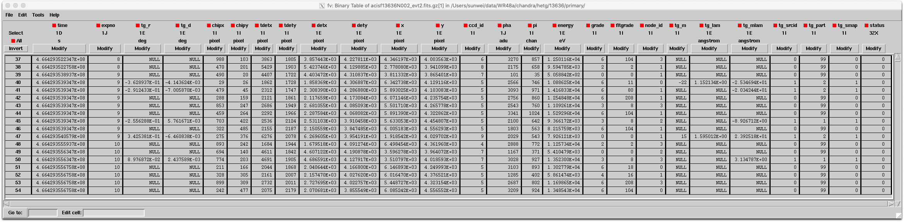

# X射线数据结构

[TOC]

在开始处理数据之前，我们需要对可获取的X射线数据，以及数据的结构有简要的了解。这里不再对X射线能段的重要性赘述：首先重要性是一个见仁见智的主管考量，其次想必大家阅读101的目标不是领会这些内容的。

## 常用的X射线望远镜{#telescopes}

X射线望远镜通常采用Imaging Spectroscopy的观测方法，通过快速地曝光和读取数据, 并且**纪录每一个光子的能量、位置、到达时间**的办法，达到同时获取X射线辐射的图像和能谱。这一方法的缺点是潜在的pile-up效应（一次曝光和读出过程中，某个pixel上收到了两个光子），并且只能得到中低分辨率的光谱。前者一般通过缩短曝光和读出时间 (短至数毫秒) 或者加滤片 (XMM-Newton) 解决；而提高光谱分辨率的努力包括添加光谱仪 (Chandra和XMM-Newton)，获取天体X射线辐射的分光光谱，以及提高探测器的能量分辨能力：未来的X射线望远镜 (XRISM, HUBS, Athena) 将配备采用了Transition Edge Sensor (TES) 技术的微量温仪  (micro-calorimeter)，可以获取具有[光谱仪分辨率](#rmf_file)的Imaging Spectroscopy观测结果。micro-calorimeter一般尺寸较大，高分辨率光谱牺牲了空间分辨能力。

下表列举了若干常用以及值得期待的X射线望远镜 (内容可能有误，而且随时都会变化)：

| 在役       |                |                |
| ---------- | -------------- | -------------- |
|            | Owner          | 接受观测申请？ |
| Chandra    | NASA           | 是             |
| XMM-Newton | ESA/NASA       | 是             |
| Swift/XRT  | NASA           | 否？           |
| eROSITA    | Germany/Russia | 否             |
| NuSTAR     | NASA           | 是             |
| etc.       |                |                |

| 档案数据                        |
| ------------------------------- |
| Suzaku, ASCA, ROSAT, RXTE, etc. |

| 未来项目                            |
| ----------------------------------- |
| XRISM, Arcus, HUBS, Athena, Lynx(?) |

 部分望远镜在软X射线能段的有效面积的对比如下图

 部分现有及过去X射线望远镜的参数比较可以在下面两个页面找到
 [链接1](https://space.mit.edu/~jonathan/xray_detect.html)
 [链接2](https://heasarc.gsfc.nasa.gov/docs/xmm/about_why.html)

## X射线数据的常见结构

令人庆幸的是，几乎所有X射线望远镜（乃至几乎所有高能天体物理设备）得到的数据都以“event list”的形式，组织成了符合FITS格式 (https://fits.gsfc.nasa.gov/fits_home.html) 的二进制表格文件。如下是一个event list的样子（用fv命令打开）：

其中最为关键的“EVENTS”数据层，存储了X射线光子的到达时间、空间位置、能量等信息：

完成basic calibration之后，把event list按照时间做bin，即可得到目标天体的lightcurve；按空间位置做bin，即是图像；按能量取bin，就是能谱：event list丰富的信息极大地方便了后续数据分析：

| 取bin方式 | 数据结果 | 科学目标     | 常用分析软件    |
| --------- | -------- | ------------ | --------------- |
| 到达时间  | 光变曲线 | 辐射时变性质 | XRONOS, Tempo-2 |
| 空间位置  | 二维图像 | 辐射空间分布 | ds9, ...        |
| 光子能量  | 能谱     | 辐射能谱特征 | XSPEC, ISIS     |

## 重要辅助文件介绍

### ARF文件和RMF文件{#rmf_file}

ARF (Auxiliary Response File) 和RMF (Redistribution Matrix File) 是描述X射线望远镜能量响应的文件，是进行能谱拟合必不可少的两个辅助文件。其中，ARF文件是望远镜有效面积和探测器量子效率的乘积，具有面积的量纲；RMF文件描述不同能量的光子被“认证”能量/“落入”某个通道的概率，它没有量纲。

因而ARF可以用于描述望远镜的观测能力。此前[望远镜介绍](#telescopes)章节中的性能比较即是拿各个望远镜的ARF文件做出来的；而RMF文件可以表征望远镜能量分辨率。下图比较了若干望远镜认证1 keV光子的概率分布函数，可以看出来当前的X射线望远镜在Imaging Spectroscopy下只有$R\sim{}20$的分辨本领，未来应用TES技术的望远镜可以达到分光观测的光谱分辨能力。

能谱拟合过程中，不同的模型也是先通过与ARF和RMF文件的积分计算，得到望远镜在特定响应下的能谱形状，再与观测结果对比：

> $C(I)=\int{}F(E)\cdot{}ARF(E)\cdot{}RMF(I,E)dE$
