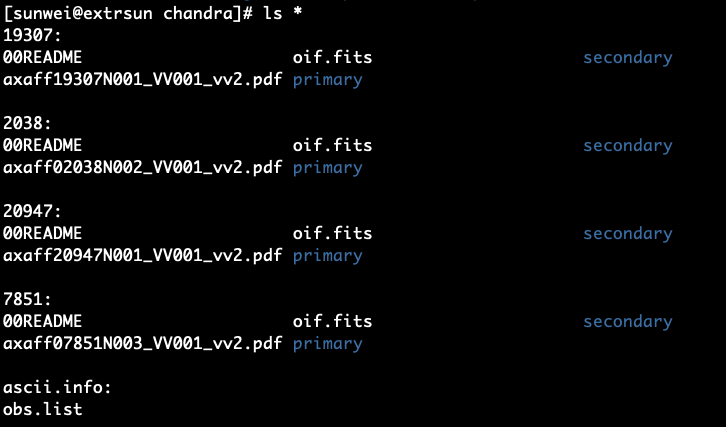

### _Chandra_ Imaging Spectroscpic Data (ACIS-S or ACIS-I) Preparation

Because of the limitation of the expsure time due to the orbit of _Chandra_ ($\lesssim150$~ ks), there may be one or more observations toward one target even for single proposal. For your specific scientific goal, there is a chance that only parts of them are usable. 

Nevertheless, I always like to organize the downloaded (archival) data according to their observational IDs (ObsIDs), into a directory like

> /path/to/your/data/xray/chandra/

then create a text file ``obs.list`` listing the all ObsIDs (or usable ObsIDs) under the subdirectory ``ascii.info``. An example of organized files is like this



**Read the ObsID**: in bash,

```bash
list=`cat ascii.info/obs.list`
```

in csh or tcsh,

```shell
set list=`cat ascii.info/obs.list`
```

**Initialize CIAO**:

```bash
ciao
```

