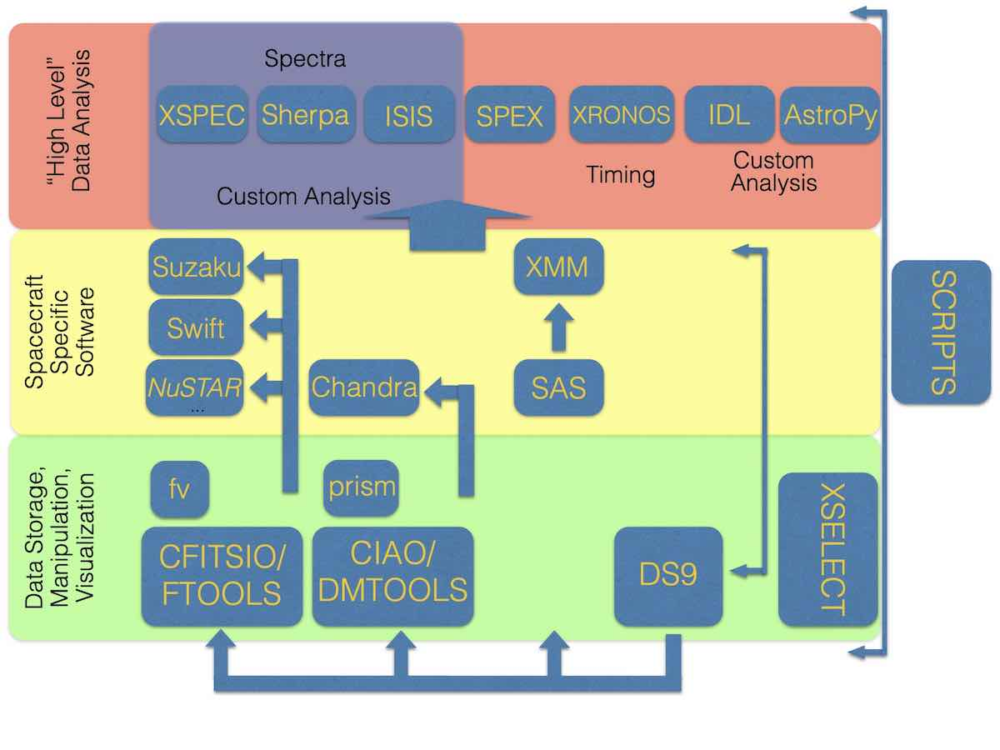

Before you try to setup these softwares of high-energy astrophysics, you should make sure that your computer contains a unix-like operation system, e.g. Linux (recommend Ubuntu if you are not familiar with them) and Mac OS. Windows 10 contains a feature named "Windows Subsystem for Linux" and might be able to run these software if you make efforts to solve some technical issues.

## Software list

1. **HEASoft** 

   [Homepage](https://heasarc.gsfc.nasa.gov/docs/software/lheasoft/). HEASoft is a huge software package, now its source code tarball is over 2.5 GB. It contains over twenty tools which are optional to install. 

   Just click the Download button. Source code verison is usually better than the binary version to avoid some problems like library missing. If you are not sure which tools are necessary in your project, select all. If download speed is to slow, this [ftp](https://heasarc.gsfc.nasa.gov/FTP/software/lheasoft/release/) provides the tarball. Decompress the tarball.

   Before you try to compile the source, please read carefully these instructions for different systems below the Download button and also the text file named “HEASOFT-INSTALL.TXT” in the folder of source code. Usually you need some libraries before you compile HEASoft.  Tool "apt" is recommanded in Ubuntu and homebrew is recommended in Mac OS to find these libraries in my opinion.

   After solving the problem of dependent libraries, you can just compile the source code following the instruction files. Note that you need add the environment variables to .bashrc (for Bourne shell) or .cshrc (for C shell) in your home directory to run HEASoft easily.

2. **DS9**(**SAOImageDS9**)

   [Homepage](http://ds9.si.edu/site/Home.html). DS9 is an astronomical imaging and data visualization application.  Go to the [Download](http://ds9.si.edu/site/Download.html) page and choose the version which is the closest to your system. Note that on Mac OS, X11 version is more convinient than the dmg version when you want to run it in the command-line interface. 

   X11 version and Linux: decompress the tarball and move them to the directory which is defined in your $PATH environment variable.

   Mac OS dmg and Windows exe: just double-click it to install.

3. **CIAO** (**Chandra Interactive Analysis of Observations**)

   [Homepage](http://cxc.harvard.edu/ciao/). CIAO is the software package for analysing data from the Chandra X-ray Telescope (huge! ~ 5GB with the CALDB). Binary version is recommanded due to it's difficult to compile on our own computer. Just use the Quick

   Installation [method](http://cxc.harvard.edu/ciao/download/)  to install CIAO. If your installation pass most of the somke tests in the end, CIAO can run correctly in most cases. Do not forgot to setup the environment variables.

4. **SAS**  (**Science Analysis System**) for XMM-Newton

   [Homepage](https://www.cosmos.esa.int/web/xmm-newton/what-is-sas). SAS is a collection of tasks, scripts and libraries, specifically for the data collected from XMM-Newton observatory.

   Go to the [page](https://www.cosmos.esa.int/web/xmm-newton/download-and-install-sas), choose the similar binary version to download. Before installation, read carefully the requirements page and make sure they have been in your system (usually, grace hasn't installed). 

   CCF(Current Calibration Files ) files are also needed. This [page](https://www.cosmos.esa.int/web/xmm-newton/current-calibration-files) tells your how to download them.

5. **CALDB** (**Calibration Database**)

   Except Chandra and XMM-Newton, most missions don't handle their CALDB by themselves. HEASARC maintains the caldb on their [webpage](https://heasarc.gsfc.nasa.gov/docs/heasarc/caldb/caldb_intro.html). Go to the [Download and Installation](http://heasarc.gsfc.nasa.gov/docs/heasarc/caldb/install.html), learn how to select

   mission-specific calibration documentations which you need, then download, decompress them and setup the environment variables.

6. **AtomDB** (**Atomic Data for Astrophysics**)

   [Homepage](http://www.atomdb.org/). AtomDB is an atomic database designed for X-ray plasma spectral modeling. Download the latest version, decompress them and setup the $ATOMDB environment variable.

7. **ISIS** (**Interactive Spectral Interpretation System**)

   [Homepage](https://space.mit.edu/cxc/isis/). ISIS is designed to facilitate the interpretation and analysis of high resolution X-ray spectra. It needs [S-Lang](http://www.jedsoft.org/slang/) library and HEASoft. S-Lang and ISIS can be compiled in standard compilation steps. If you not familiar with manually installation, this [page](https://space.mit.edu/cxc/isis/install.html) could help you.

   Because S-Lang gives ISIS the power to run scripts, there are many useful scripts in data analysis. 

   - https://space.mit.edu/home/mnowak/isis_vs_xspec/download.html

   - http://www.sternwarte.uni-erlangen.de/isis/
   - https://space.mit.edu/cxc/software/slang/packages/ , etc.

8. **SPEX** 

   [Homepage](https://www.sron.nl/astrophysics-spex). SPEX is a software package optimized for the analysis and interpretation of high-resolution cosmic X-ray spectra provided by SRON. This [page](https://www.sron.nl/astrophysics-spex/download/linux-and-mac) tells you how to install and setup SPEX.

9. 

10. 

## Environment variables setting

For bash or zsh, some environment variables in my .bashrc (can be another name, e.g. .bash_profile) like the following, modify them to the correct ones according to your system.

```bash
export HEADAS=/usr/local/heasoft-6.13/x86_64-unknown-linux-gnu-libc2.15-0
alias heainit=". $HEADAS/headas-init.sh"
alias ciao="source /usr/local/ciao-4.5/bin/ciao.bash"
alias sasinit=". /usr/local/SAS/xmmsas_20130501_1901/setsas.sh"
export CALDB=/usr/local/caldb
export CALDBCONFIG=$CALDB/software/tools/caldb.config
export CALDBALIAS=$CALDB/software/tools/alias_config.fits
export ATOMDB=/usr/local/atomdb/atomdb_v3.0.9
SPEX90=/usr/local/SPEX-3.04.00-Linux
alias spexinit="source $SPEX90/spexdist.sh"
```

For csh or tcsh, you can change them like these in .cshrc file:

```shell
setenv HEADAS /usr/local/heasoft-6.13/x86_64-unknown-linux-gnu-libc2.15-0
alias heainit "source $HEADAS/headas-init.csh"
alias ciao " source /usr/local/ciao-4.5/bin/ciao.csh"
alias sasinit "source /usr/local/SAS/xmmsas_20130501_1901/setsas.csh"
setenv CALDB /usr/local/caldb
setenv CALDBCONFIG $CALDB/software/tools/caldb.config
setenv CALDBALIAS $CALDB/software/tools/alias_config.fits
setenv ATOMDB /usr/local/atomdb/atomdb_v3.0.9
setenv SPEX90 /usr/local/SPEX-3.04.00-Linux
alias spexinit "source $SPEX90/spexdist.sh"
```

After the installations,  you can input heainit, ciao, sasinit, ds9, isis, etc. in your terminal to check that every software can run correctly.


There is a map can tell you their relationships, (credit: Mike Nowak 2016)



Important!

Before you begin to run any software for data reductions, please read carefully the manuals, cookbooks or guides of these softwares from their websites to make sure that nothing necessary is missing in your system.
